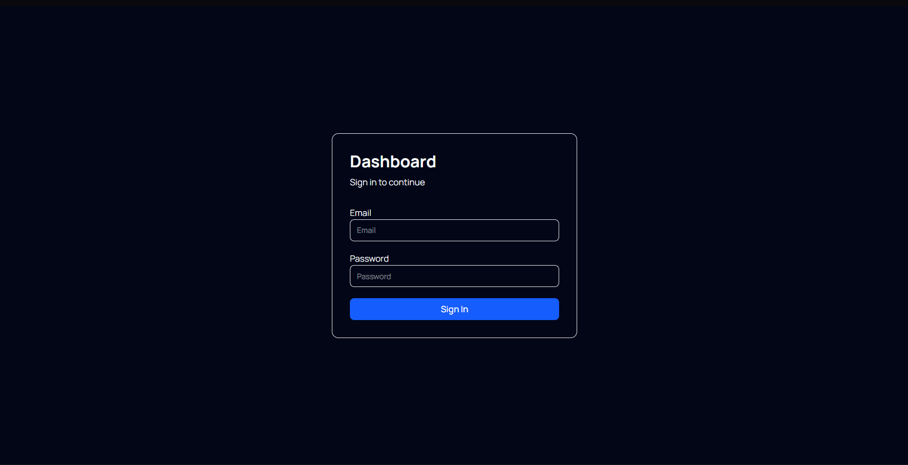
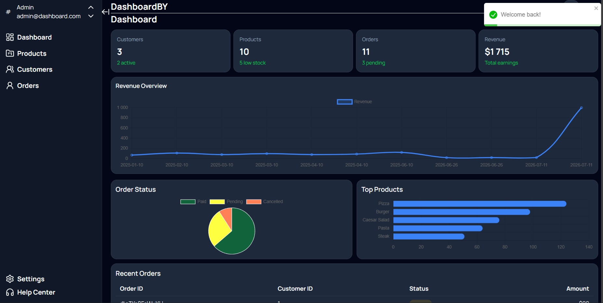
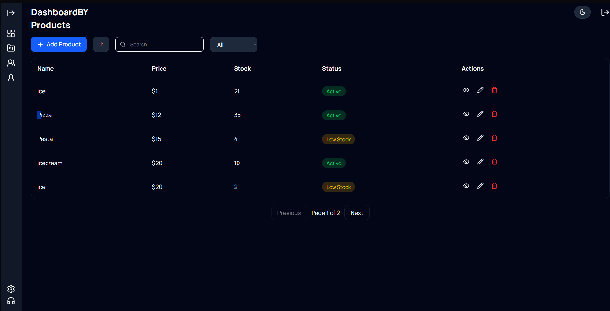
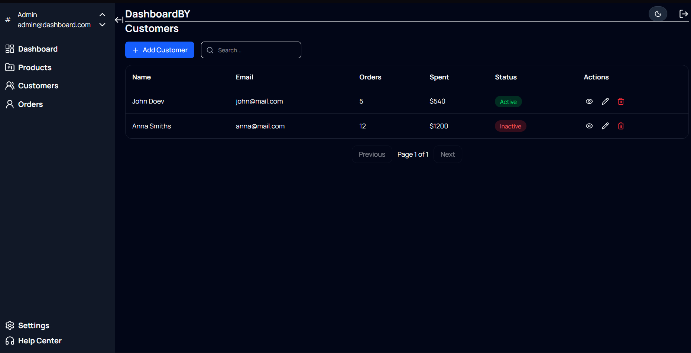
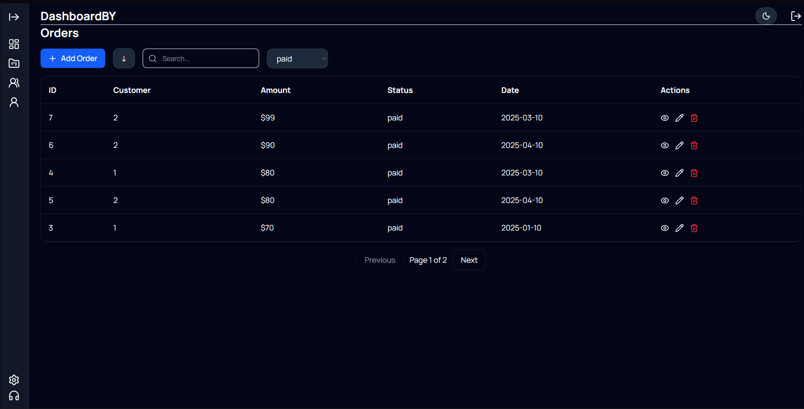
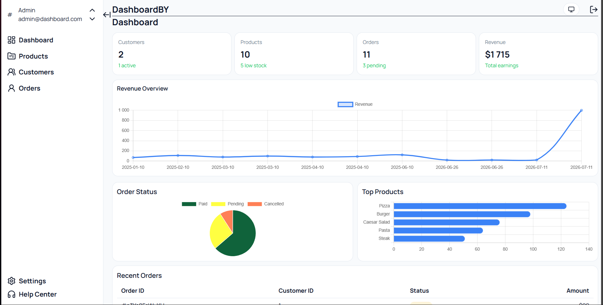

# 📊 Dashboard Admin Panel

Modern Admin Dashboard built with **React**, **TypeScript**, **TanStack Router**, **React Query**, **Tailwind CSS**, and **Chart.js**.

The application allows managing products, customers, and orders through a clean dashboard interface with authentication, CRUD operations, search, filtering, sorting, pagination, reusable UI components, and charts.

---
Live demo -https://dashboards-beta-plum.vercel.app/dashboard

## 🔐 Demo Credentials

Email

```text
admin@example.com
```

Password

```text
admin123
```

---
## 📸 Screenshots

### Login



---

### Dashboard



---

### Products



---

### Customers



---

### Orders



---

### Light Theme



---

## 🚀 Features

### Authentication

- Fake authentication
- Protected routes
- Persistent session (LocalStorage)
- Logout

### Dashboard

- Statistics cards
- Revenue chart
- Orders pie chart
- Top products
- Recent orders

### Products

- View products
- Add product
- Edit product
- Delete product
- Search
- Sort
- Pagination
- Validation with Zod

### Customers

- View customers
- Add customer
- Edit customer
- Delete customer
- Search
- Sort
- Pagination
- Validation

### Orders

- View orders
- Add order
- Edit order
- Delete order
- Search
- Filter by status
- Sort
- Pagination

### Reusable UI

- Button
- Input
- SearchInput
- Modal
- Pagination
- Empty State
- Error State
- Table Skeleton

### Other

- Dark / Light Theme
- Responsive Design
- Toast Notifications
- React Hook Form
- Zod Validation
- React Query
- Fake API (JSON Server)

---

## 🛠 Tech Stack

- React
- TypeScript
- Vite
- TanStack Router
- TanStack React Query
- Tailwind CSS
- Chart.js
- React Hook Form
- Zod
- React Toastify
- JSON Server
- Vitest
- Testing Library

---

## 📂 Project Structure

```text
src
│
├── components
│   ├── common
│   ├── layout
│   ├── products
│   ├── customers
│   ├── orders
│   └── ui
│
├── hooks
├── api
├── auth
├── routes
├── types
├── validation
└── lib
```

---

## ⚙️ Installation

```bash
git clone https://github.com/oleg2703/Dashboards.git

cd Dashboards

npm install
```

---

## ▶️ Run Application

Start JSON Server

```bash
npx json-server db.json --port 3001
```

Start development server

```bash
npm run dev
```

---

## 🧪 Run Tests

```bash
npm run test
```

---


## 📈 Project Highlights

- Reusable UI components
- Generic CRUD hook
- Generic Table hook
- Generic Modal
- Protected Routes
- Authentication Context
- Custom Hooks
- Form Validation
- React Query
- Responsive Layout
- Component Testing

---

## 📋 Future Improvements

- Real Backend API
- JWT Authentication
- User Roles
- Export to Excel
- Export to PDF
- Dashboard Analytics
- Unit & Integration Tests
- CI/CD
- Docker

---

## 👨‍💻 Author

**Oleg Lebid**

GitHub:
https://github.com/oleg2703