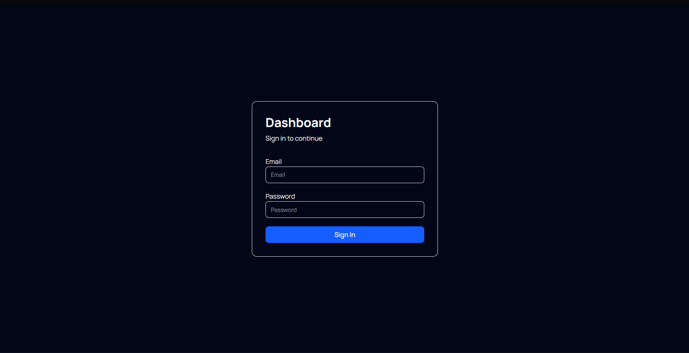
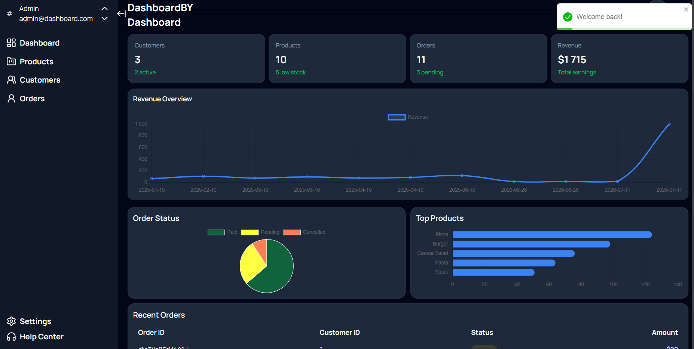
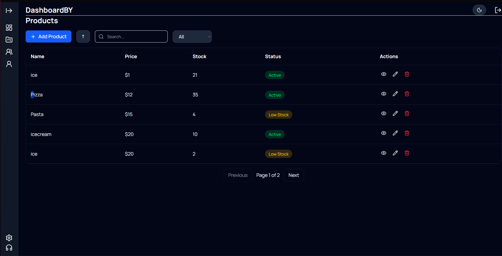
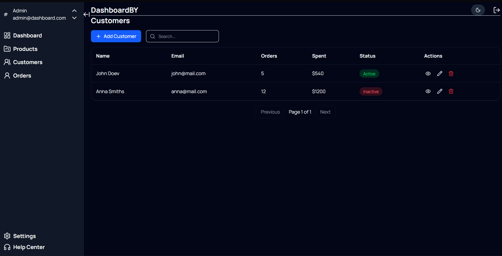
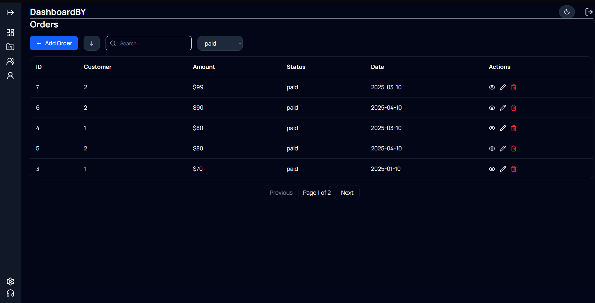
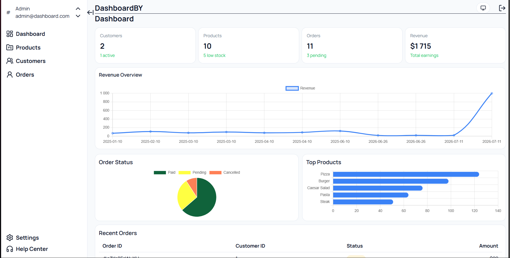

# 📊 Dashboard Admin Panel

Modern Admin Dashboard built with **React**, **TypeScript**, **TanStack Router**, **React Query**, **Tailwind CSS**, and **Chart.js**.

The application allows managing products, customers, and orders through a clean dashboard interface with authentication, CRUD operations, search, filtering, sorting, pagination, reusable UI components, and charts.

---

Live demo -https://dashboards-beta-plum.vercel.app

## 📸 Screenshots

### Login



---

### Dashboard



---

### Products



---

### Customers



---

### Orders



---

### Light Theme



---

## 🚀 Features

### Authentication & Authorization

- Supabase Authentication
- Protected routes
- Role-based access (Admin / Manager / Viewer)
- Row Level Security (RLS)

### Dashboard

- KPI cards
- Revenue analytics
- Orders overview
- Top products
- Recent orders
- Interactive charts

### Products

- Create, update, delete products
- Automatic stock status
- Search
- Sorting
- Pagination
- Form validation

### Customers

- CRUD operations
- Search
- Sorting
- Pagination
- Automatic spending statistics

### Orders

- CRUD operations
- Customer & product selection
- Automatic total calculation
- Stock validation
- Atomic order creation using PostgreSQL functions
- Automatic stock synchronization with database triggers

### General

- Responsive design
- Dark / Light theme
- Toast notifications
- Reusable UI components
- Form validation with Zod
- Component testing

---

## 🛠 Tech Stack

- React 19
- TypeScript
- Vite
- TanStack Router
- TanStack React Query
- Tailwind CSS
- Supabase
  - PostgreSQL
  - Authentication
  - Row Level Security (RLS)
- Chart.js
- React Hook Form
- Zod
- Vitest
- GitHub Actions

---

## 📂 Project Structure

```text
src
│
├── api
├── auth
├── components
├── hooks
├── lib
├── routes
├── types
├── validation
└── data

supabase
└── migrations
```

---

## ⚙️ Installation

```bash
git clone https://github.com/oleg2703/Dashboards.git

cd Dashboards

npm install

cp .env.example .env

npm run dev
```

---

## 🧪 Testing

```bash
npm run test
```

---

## ⭐ Highlights

- Relational database design
- SQL migrations
- PostgreSQL functions
- Database triggers
- Row Level Security (RLS)
- Generic CRUD architecture
- Generic table components
- React Query data management
- Form validation
- Responsive UI
- Component testing
- CI with GitHub Actions

---

## 👨‍💻 Author

**Oleg Lebid**

GitHub: https://github.com/oleg2703